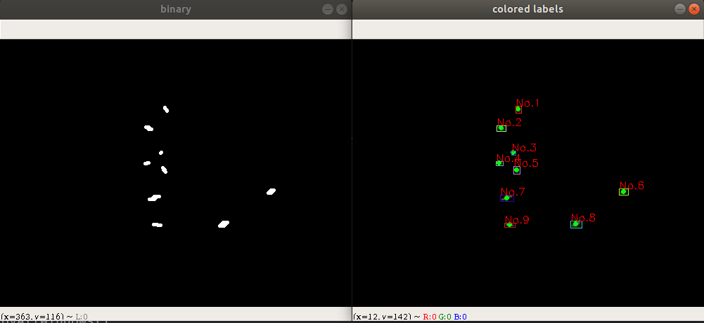
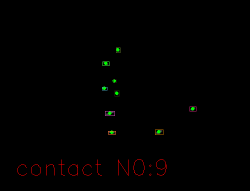
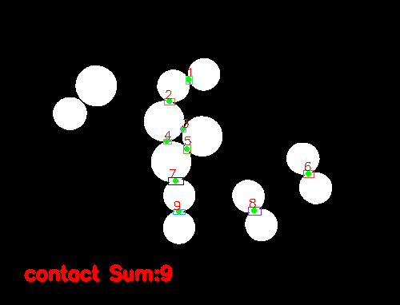

# About Particle detection、Object count、watershed line、Contact Extract and Image Relate Experiment

- Contact Detection results

  
  
  

- Paste multiple image results

  
  
  

- Contact results show

  
  

